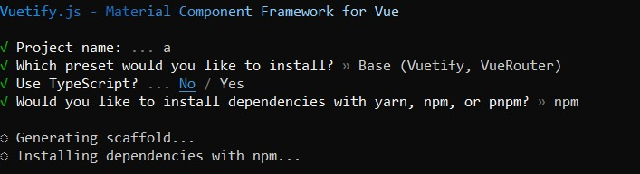

# base

## Project setup

```
# npm
npm create vuetify
npm install tailwindcss@latest postcss@latest autoprefixer@latest
npm install -D tailwindcss postcss autoprefixer
npx tailwindcss init
```



### Compiles and hot-reloads for development

```
# npm
npm run dev
```
